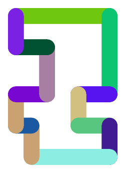
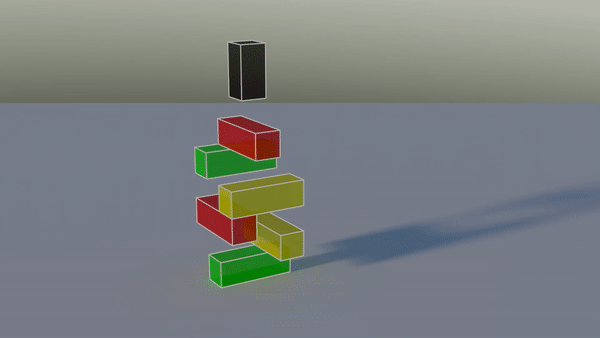
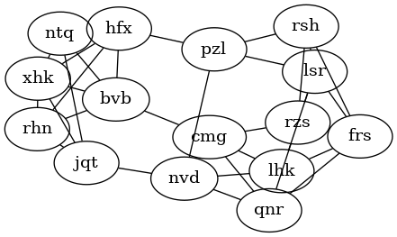

Advent of Code 2023
===================

  The Advent of Code sets a new coding challenge every day on the lead up to Christmas. 
  https://adventofcode.com/2023

  I was a bit late to the party but here are some random solutions to the 2023 challenge using python.

Day 5
-----
  This frustrated me fro a long time but starting late gave plenty of other challenges to distract me.
  It was very easy to set up the first part by walking through the mappings. 
  Then BANG the second part hits, and there is no way you can brute force this one so time for a new approach. 
  I had a basic plan quite quickly but it took lots of debugging and doodling on paper to get the order of operations and iterations exactly right.

Day 10
------
  

Day 15
------
  Quite a quick challenge today! Easy to expliot the datastructures in python to perform this calculation exactly as described in the challenge. I followed the instructions verbatim for HASH and popped all the information into an OrderedDict, expliting del to remove anything. This was good because it gave me time to sort out day 12.

Day 16
------
  There is another christmas maze, this time with light paths and mirrors.

  It is straightforwards to set up the maze and iteritively follow the light path. 
  The challenge is reminiscent of the pipes network on day 10 and 
    managed to repurpose a lot of setup and iteration code from that challenge.
  The key twist is that that there are beam splitters so each step can make multiple new beams.
  Additionally, the light can bounce forever between mirrors.
    
  To solve the problem I stepped through the maze one step at a time,
    logging each step and direction of a journal numpy.array.
  The journal also allowed tracking of any repeated light paths to avoid duplication or infinite loops.
  Using 1 bit per direction allowed for easy checking and combination, e.g. N = 1, W = 8 so NW = N | W = 9.

  Part two could have been a big one but the answer was revealed by brute force in only a few seconds.
  If the maze was bigger, or the challenge more complex an speedup could be achieved by caching
  light paths because brute force would have sent that poor reindeer all over the lava production facility
  with light repeating multiple times. 

Day 17
------
  Interesting graph problem that took a while to match my code with the algorithm in my head.
  I was concerned from the start about how to manage the problem that a worse route might turn out better later on. 
  At each point I considered all possible steps in a given direction at once,
  and rather than save the best score at every location, I saved the score at every location by next destination.
  Once working with the sample, I did some tuning to balance considered routes in terms of lowest score vs closeness to end.
  I was so rigorous in getting part one working that the second part only took a few additional lines of code!

Day 18
------
  I used horizontal raycasting to find the area.
  I considered each line and found the area between the trenches by inverting an "enclosed" variable.
  Today's silly mistake was forgetting to reset the area counter so that my answer for part 1 was off by 62 (the example answer)!
  Switching to part 2 meant that the horizonal part of the calculation took exactly the same time
  but the vertical part was significantly slower because I was scanning line-by-line.
  Thinking harder, the enclosed and trench area of a ray only changes on a row with at least one horizontal line.
  Updating the algorithm only to look for horizontal lines and then consider the lines between each,
  so now the time taken to calculate area is dependent only on the complexity of the shape and no the length of any line.
  

Day 19
------
  The first part was nice and easy, just have to parse the commands
  then a little recursion gives the answer very quickly.
  Onto part two and today it straight tells you not to bother brute forcing with 167 million million combinations.
  The problem seems very similar to day 5 where ranges need splitting and dispatching off to various destinations.
  The code didn't take very long to adapt to the given task but I could not get the correct answer for a long time.
  Then.... I noticed that  I used inclusive ranges and was feeding in  (0,4000) instead of (1,4000) and there you go!

Day 20
------
  What a whacky machine. I enjoyed setting up the classes for each module and the first part worked quite well.
  The second part was quite frustrating and certainly a brute force approach dind't find anything quickly.
  As as for earlier, the trick was to find the repeat interval of various nodes and then calculate the LCM.

Day 22
------
  I spend a lot of my early python journey in Blender and this give a great opportunity to visualise a falling block challenge.
  I created a Brick class that contained brick information and used a numpy array of objects within a Stack class to represent the stack of bricks.
  Then the falling is implemented from the bottom of the stack up by slicing beneath the xy cross section of each block and checking for the first object.
  The objects are linked together so that the reliance of blocks on blocks underneath can be checked later.
  The only major issue I had was that my code didn't drop blocks that were above nothing to start with, but after that everything worked ok!
  

Day 23
------
  I imported the map as a 2D numpy array with a charachter for each location.
  Then processed the map by padding it with "#" and the slicing in each cardinal direction to calculate the type of each square as a bit set.
  Any points with 3, 4 or 1 neighbors create a Junction object (1 being entry and exit points).
  Any points with 2 neighbors are gathered into Path objects and connected to the junctions that they meet.
  This gives a graph of junctions connected by paths, then traverse the whole graph not particularly imaginatively keeping score

Day 24
------
  Not so much a problem in coding as a problem in maths! Pretty good rock throw though!
  

Day 25
------
  I think we had been bad this year because santa gave a graph problem on Christmas morning.
  I had a quick look at graphviz's neato version of the challenge and it is very clear to see the three links that needed cutting. 
  Algorithmically, I started from each node and condensed edges to adjoining nodes until the number of links going out was only three. 
  This was quite slow and does not guarantee an answer for all graphs but it worked!
  

