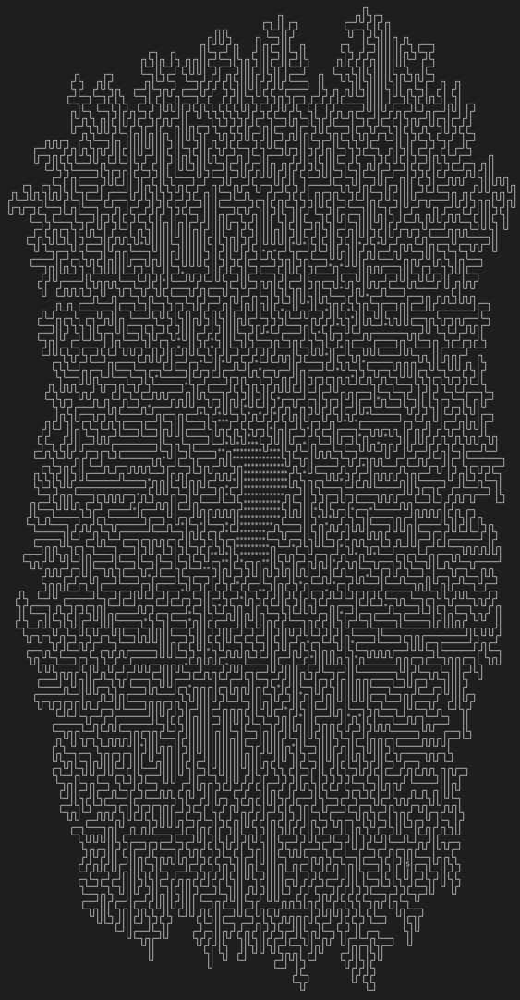

Advent of Code 2023
===================

  The Advent of Code sets a new coding challenge every day on the lead up to Christmas. 
  https://adventofcode.com/2023

  I was a bit late to the party but here are some random solutions to the 2023 challenge using python.

  My favourite ouput so far was from Day 10!
  

Day 15
------
  Quite a quick challenge today! Easy to expliot the datastructures in python to perform this calculation exactly as described in the challenge. I followed the instructions verbatim for HASH and popped all the information into an OrderedDict, expliting del to remove anything. This was good because it gave me time to sort out day 12.

Day 16
------
  There is another christmas maze, this time with light paths and mirrors.

  It is straightforwards to set up the maze and iteritively follow the light path. 
  The challenge is reminiscent of the pipes network on day 10 and 
    managed to repurpose a lot of setup and iteration code from that challenge.
  The key twist is that that there are beam splitters so each step can make multiple new beams.
  Additionally, the light can bounce forever between mirrors.
    
  To solve the problem I stepped through the maze one step at a time,
    logging each step and direction of a journal numpy.array.
  The journal also allowed tracking of any repeated light paths to avoid duplication or infinite loops.
  Using 1 bit per direction allowed for easy checking and combination, e.g. N = 1, W = 8 so NW = N | W = 9.

  Part two could have been a big one but the answer was revealed by brute force in only a few seconds.
  If the maze was bigger, or the challenge more complex an speedup could be achieved by caching
  light paths because brute force would have sent that poor reindeer all over the lava production facility
  with light repeating multiple times.
  

Day 5
-----
  FINALLY DONE! This has been bothering me for a few days but starting late gave plenty of other challenges to distract from this one.
  Very easy to set up the first part by walking through the mappings. 
  Then BANG the second part hits, and there is no way you can brute force this one so time for a new approach. 
  I had a basic plan quite quickly but it took lots of debugging and doodling on paper to get the order of operations and iterations exactly right.
  
Day 19
------
  The first part was nice and easy, just have to parse the commands
  then a little recursion gives the answer very quickly.
  Onto part two and today it straight tells you not to bother brute forcing with 167 million million combinations.
  The problem seems very similar to day 5 where ranges need splitting and dispatching off to various destinations.
  The code didn't take very long to adapt to the given task but I could not get the correct answer for a long time.
  Then.... I noticed that  I used inclusive ranges and was feeding in  (0,4000) instead of (1,4000) and there you go!

   
  
  
